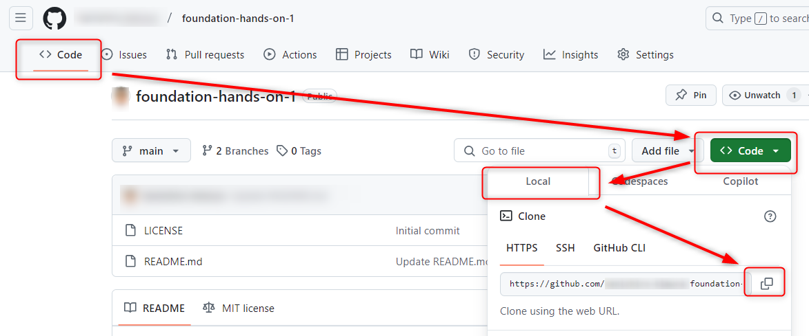

# ドメイン1:GitとGitHubの紹介

## リポジトリの作成

github.comで、自身のアカウントに以下の通りのパブリックなリポジトリを作成する。
  
- 名前は`foundations-hands-on-1`
- README作る
- ライセンスはMITを選択
- .gitignoreは不要

## リポジトリのクローンとgitの操作

自身のPCにクローンして、gitの基本操作を行ってみる。

- git configで自身の名前とメールアドレスを設定しておく(事前準備が済んでいない場合)
    - `git config --global user.name "あなたの名前"`
    - `git config --global user.email "あなたのgithubのアカウントのメールアドレス"`
- リポジトリのページのナビゲーションのCodeで、「Code」ボタンからHTTPSのURLをコピーする
  - 
  - `git clone 取得したURL`
  - `cd foundations-hands-on-1`
- 作業用ブランチを作成する
  - `git switch -c update-readme`
- `README.md`を編集する
  - 適当な文字列を追加する
- 状態を確認する
  - `git status`
  - 変更されたファイルが1つあり、ステージされていないというメッセージが出るのを確認する
- 変更したファイルをステージングエリアに追加する
  - `git add README.md`
- 状態を確認する
  - `git status`
  - 変更されたファイルが1つあり、ステージされているというメッセージが出るのを確認する
- ステージングエリアのファイルをコミットする
  - `git commit -m "[modify] update README"`
- リモートリポジトリにプッシュする
  - `git push --set-upstream origin update-readme 
    - 手元で作成したブランチをリモートリポジトリに作成する場合、`--set-upstream`オプションを付ける必要がある
- github.comでリポジトリにアクセスし、ファイルが変更されているのを確認する
  - ナビゲーションのCodeの左上の方にブランチがあるので、ここからプルダウンで`update-readme`を選択する
- 画面上から`README.md`を変更する(鉛筆ボタンを押す)
  - 資料で説明されたmarkdownを色々書いてみる
  - [公式ドキュメント](https://docs.github.com/ja/enterprise-cloud@latest/get-started/writing-on-github/getting-started-with-writing-and-formatting-on-github/basic-writing-and-formatting-syntax)
  - 変更内容を直接コミットする
- 画面で変更したものをローカルのリポジトリに反映する
  - `git pull`
  - `README.md`が変更されているのを確認する

## GitHub Desktop

インストール可能ならば、GitHub Desktopをインストールして動かしてみる。
  
- [GitHub Desktopのインストール方法](https://docs.github.com/ja/enterprise-cloud@latest/desktop/installing-and-authenticating-to-github-desktop/installing-github-desktop)

## GitHub Mobile

インストール可能ならば、GitHub Mobileをインストールして動かしてみる。

---
[次のドメインへ](../domain2/README.md)  
[目次へ](../README.md)
