# ドメイン3:共同作業機能

## Issueの作成と操作

Issueの作成と操作について確認する。

- `foundations-hand-on-2`リポジトリにgithub.comでアクセスし、ナビゲーションのIssuesにアクセスする
- 「New issue」ボタンでIssueを作る。入力できる項目を確認する。descriptionにマークダウンが使え、ツールチップでの入力やスラッシュコマンド(`/`を入力してみる)が使えることを確認する
  - 
  - 「README.mdの更新」という内容にする
- 作成したIssueの画面を見る。右側にメタデータがあることを確認し、それぞれが何を表しているかを確認する。
  - メタデータのDevelopmentから`update-readme`ブランチと紐付けてみる
  - 
  - ピン留めしてみる
  - 
- 2つめのIssueを作る
  - 1つめと同じ、「README.mdの更新」という内容にする
- Issueの一覧で、フィルターやソートをしてみる
- それぞれのIssueの一番下のボタンからクローズ、再オープンしてみる 
  - クローズに2種類あることを確認する
  - 
  - フィルターの「is:open」を「is:closed」に変更してクローズしたものにアクセスして、再オープンしてみる
  - 
  - 
- 2つめのIssueにアクセスし、重複とするためにコメントに`Duplicate of #1`と入力する
  - マークがついたとメッセージが出ていることを確認する
  - 
  - これは、以下のようなケースで使うことを講師は説明する
    - もし重複したIssueを見つけたとしても、多くの人にはIssueの削除の権限がない
    - 削除できないが、「解決済み」としてcloseするのは適切でない
    - そこで、クローズする前にマークしておくことで、クローズの理由を伝えることができる
    - 現在はクローズの種類として「Close as not planned」があるのでそれを併せて使う
- リポジトリをもう１つ作る
  - 名前は`foundations-hands-on-3`
    - パブリック、READMEあり、ライセンスはMIT、.gitignoreはなし
  - `foundaitons-hands-on-3`リポジトリでIssueを作る
    - 内容は`転送のテスト`とする
    - Issueの右下の「Transfer」ボタンで、`foundations-hand-on-2`リポジトリに転送してみる
    - 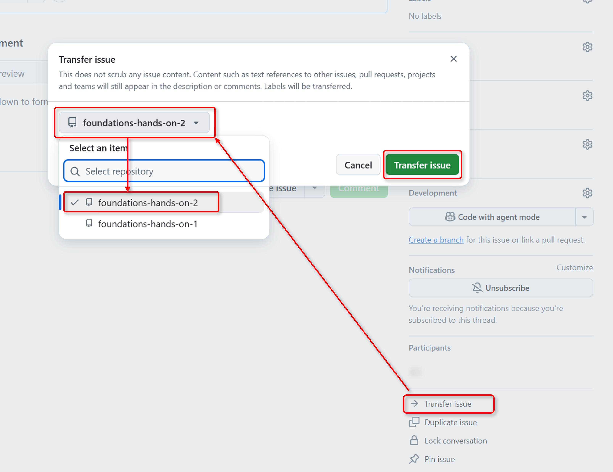
  - 転送されていることを確認する
  - 転送されてきたIssueを右下のボタンで削除してみる
  - 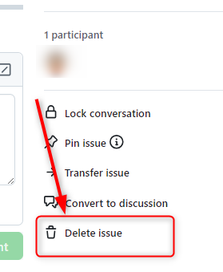
- Issue templateとFormsを作ってみる
  - **Issue template**：Feature request のテンプレートを作る
    - `foundations-hands-on-2`リポジトリにgithub.comでアクセスし、ナビゲーションのSettingsにアクセス
    - General > Features > Issuesで「Set up templates」ボタンを押してテンプレートを作ってみる
    - 
    - `Add template: select` から `Feature request` を選ぶ
    - 
    - `Preview and edit`  ＞ `✏️` で編集画面に移動して、テンプレートを編集する
    - 
    - 
    - 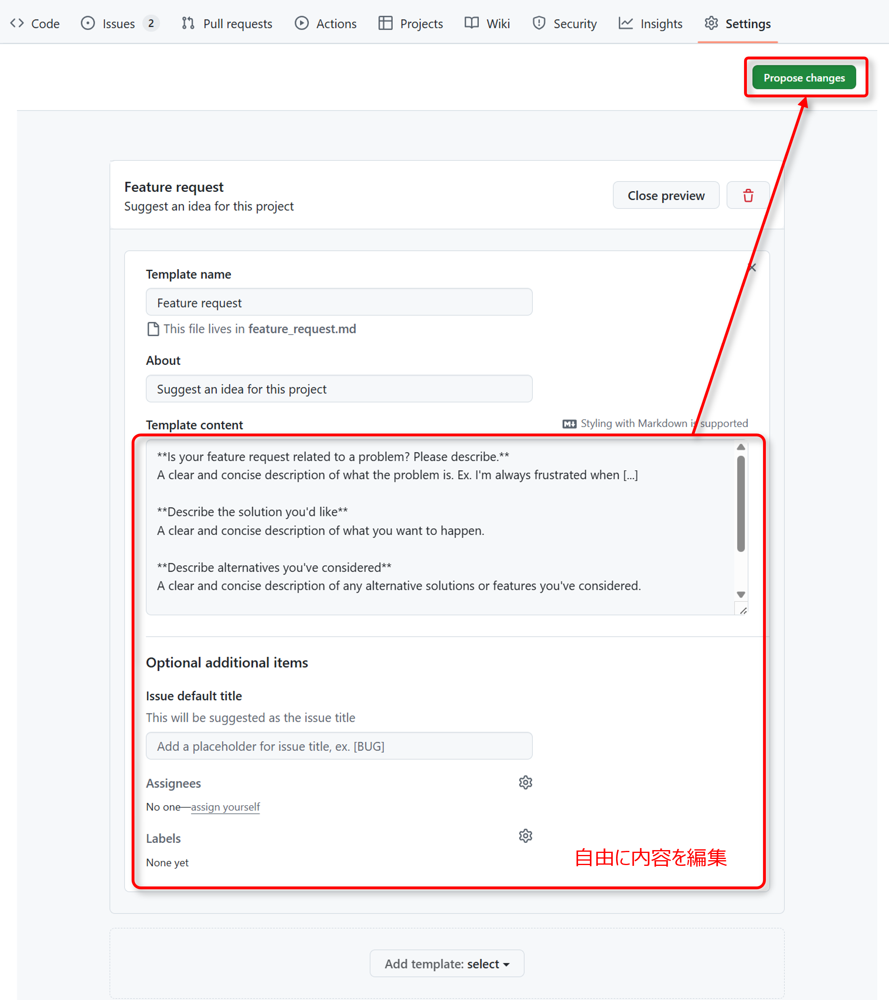
    - 作成したファイルは`.github/ISSUE_TEMPLATES/`にあることを確認する
  - **Forms**：Bug report のフォームを作る
    - Formsは[サンプルのYAML](./bug-report.yml)をコピペして、`.github/ISSUE_TEMPLATES/bug-report.yml`を作成する
  - Issue template と Forms をそれぞれ使ってIssueを作ってみる

## Pull Requestの作成と操作

Pull requestの作成と操作について確認する。

- `foundations-hands-on-2`リポジトリにgithub.comでアクセスし、CODEOWNERSファイルを新規に作成する
  - ハンズオンの相方をリポジトリに招待する
    - リポジトリのナビゲーションのSettingsからCollaborators and teamsにアクセスし、「Add people」ボタンを押す
    - 
    - 相方に招待メールが届いているので、リンクをクリックして招待を受け入れてもらう
  - ハンズオンの相方をCODEOWNERSファイルでレビュアーにいれておく
  - 書式は`*    @相方のアカウント名`
  - 
- github.com上でリポジトリにアクセスし、ナビゲーションのCodeから適当なファイルを選ぶと、設定したアカウント名がオーナーとしてホバーされることを確認する
- 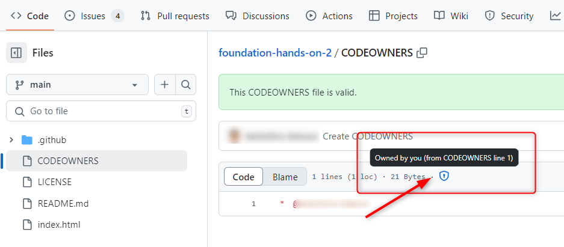
- mainブランチの`README.md`を更新。`foundation-1`という記載を`foundation-2`にし、直接プッシュではなく`Create a new branch`を押す
- 作成したブランチからPull Requestを作る
  - ナビゲーションのPull requestから「New Pull request」を押す
  - 
  - タイトルに`Update README.md`を入れる
    - Descriptionは適宜入力しつつ、`Close #1`を入れる(もし作成したIssueの番号がずれてるなら#の後ろの数字を変える。#を入れたら補完が効く)
    - 作成したらCODEOWNERSに先ほど入れた、ハンズオンの相方の人が自動的にレビュアーに入ってる事を確認する
- 作ったものを確認し、4種のタブがあることを確認する
- コメントしてみる
  - マークダウンやslash commandが使えることを確認する
- Pull Requestのステータスについて確認する
    - 作った状態がOpen
    - Reviewersの所からdraftに変更できる。作業中でまだレビューを受けられる状態ではないようなときはdraftにしておく(作成時にdraftにもできる)
    - 
    - コメントの下の方が「Ready for review」を押してOpenに戻せる
    - 
    - コメントの下のボタンを押してClosse、Reopenできる
    - 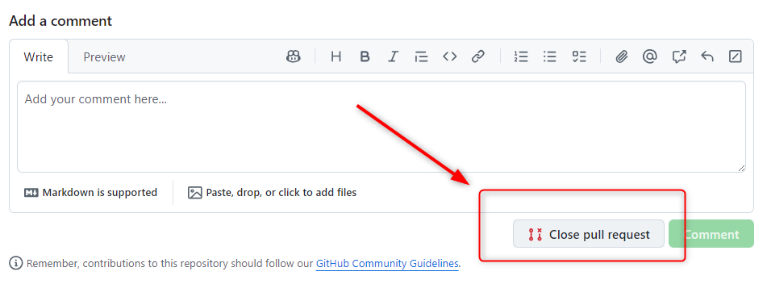
- レビューしてみる
  - 自分のものにもレビューはできるが、できるだけハンズオンの相方のものをレビューする
  - レビューのステータスについて確認する
- レビューで変更提案を出す
  - ツールチップからか、[suggestionコードブロック](./suggestion.md)を直接入力する
  - 
  - 取り入れると即座に内容がコミットされることを確認する
  - 
- Pull requestのメターデータの「Development」からIssue #2を追加でリンクしてみる
- 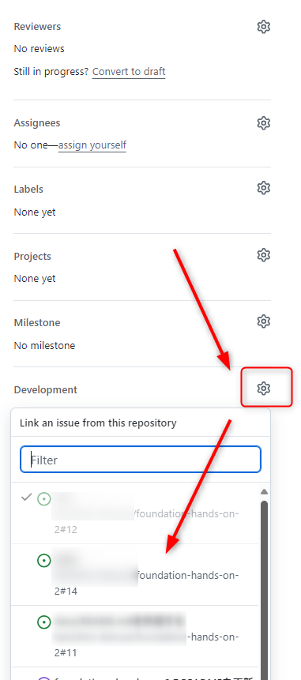
- マージしたら自動でクローズされてIssueの#1/#2もクローズされることを確認する
  - マージでクローズしたものは再オープンができないことを確認する
- Pull requestテンプレートを作って、テンプレートを使ったpull requestを作ってみる
  - `.github/pull_request_template.md`を作成する
  - [サンプルテンプレート](./pull_request_template.md)を貼り付けてコミットする
  - 新しいIssueを作成してみて、Descriptionにテンプレートの内容が含まれていることを確認する

## Discussions

Discussionsについて確認する。

- `foundations-hands-on-2`リポジトリのナビゲーションのSettingsからDiscussionsをONにする
  - 
  - 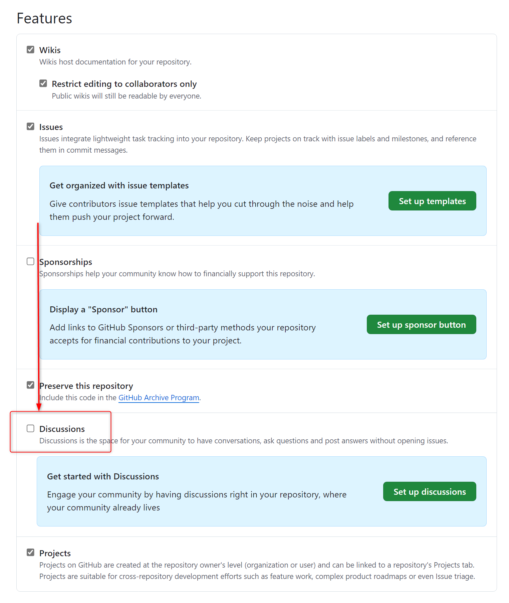
- ナビゲーションにDiscusisonsが表示されることを確認する
- Discussionsにアクセスする
- カテゴリーがあることを確認する
- カテゴリー「Q&A」でスレッド(Discussion)を作る
  - 回答を書き込んでみる
  - 回答とマークしてみる
  - ピン留めしてみる
  - DiscussionからIssueを作成してみる
  - 

## 通知

通知について確認する。

- 任意のページから通知に移動し、届いている通知一覧を見る
  - 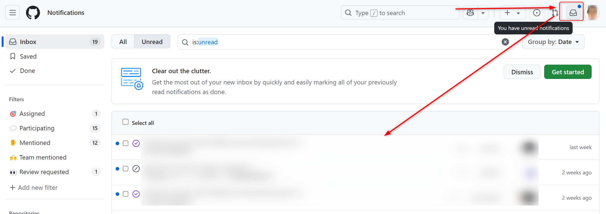
- IssueやPull requestのそれぞれのSubscription状態を見る
  - 自身が作ったので、自動的にSubscribeされている(Participate)ことを確認する
    - 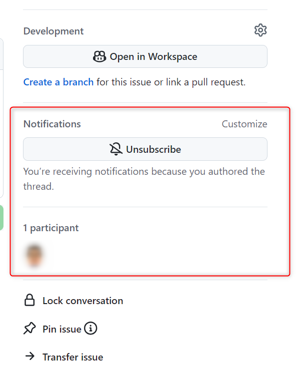
  - Unsubscribeしてみる
- `foundations-hands-on-2`のナビゲーションのCodeに移動し、「watch」ボタンで何が選べるかを確認する
  - 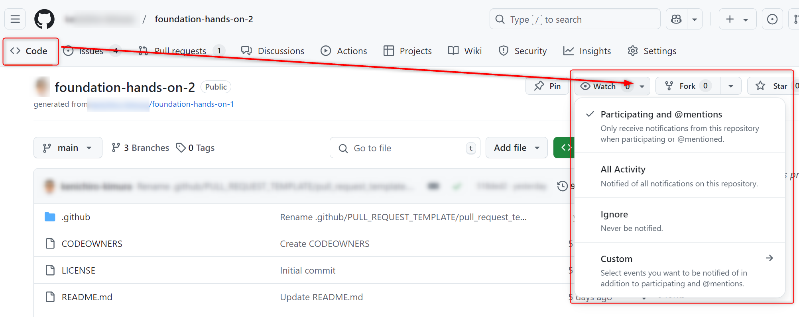
- 通知ページから、ユーザー設定を見る(左下の「Manage notifications」)
  - 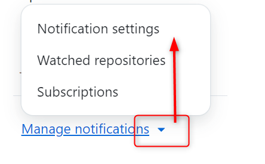

## Gistについて

Gistについて確認する。

- 任意のページからアカウントアイコンを押し、「Your Gists」を押してGistにアクセスする
  - 
  - 
- 新しいGistを作る
  - 一旦secretで作成する
  - 「Edit」からpublicにしてみる
    - 
    - 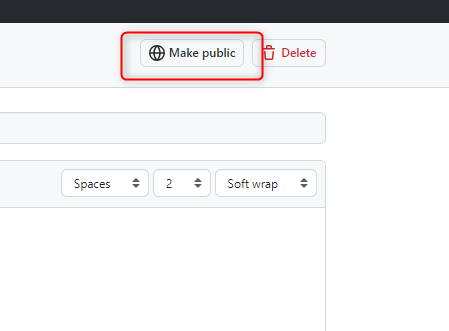
    - public->secretはできないのを確認する
- fork/cloneのやり方を確認する
  - embedのプルダウンからクローンできる
  - 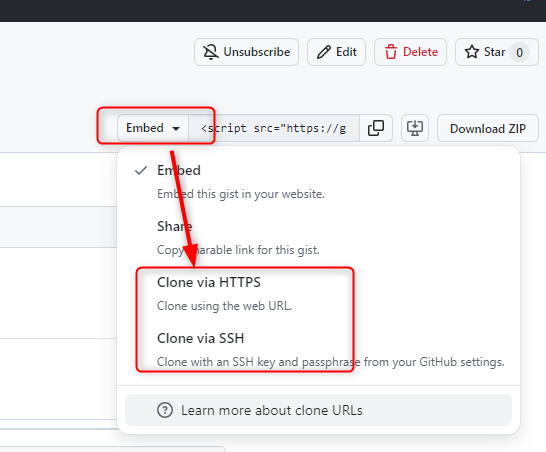
  - forkは人のものだけなので、ハンズオンの相方のpublicなgistにアクセスしてみる
    - 右上のForkを押す
    - 

## Wikiについて

Wikiについて確認する。

- `foundations-hands-on-2`リポジトリのナビゲーションのWikiからWikiにアクセスして、読み書きしてみる
- ナビゲーションのSettings > FeaturesでWikiの権限を見てみる
  - 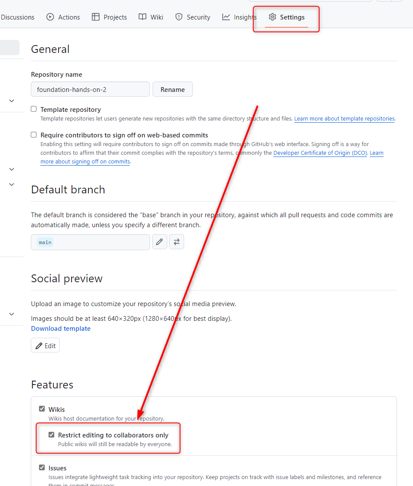
- 同じくナビゲーションのSettings > Featuresから、Wikiをオフにできることを確認する

## Pagesについて

GitHub Pagesについて確認する。

- `foundations-hands-on-2`リポジトリのナビゲーションのSettingsからPagesをONにする  
  - Sourceに「Deploy from branch」を選び、`main`リポジトリの`/(root)`を選択してSaveする
  - 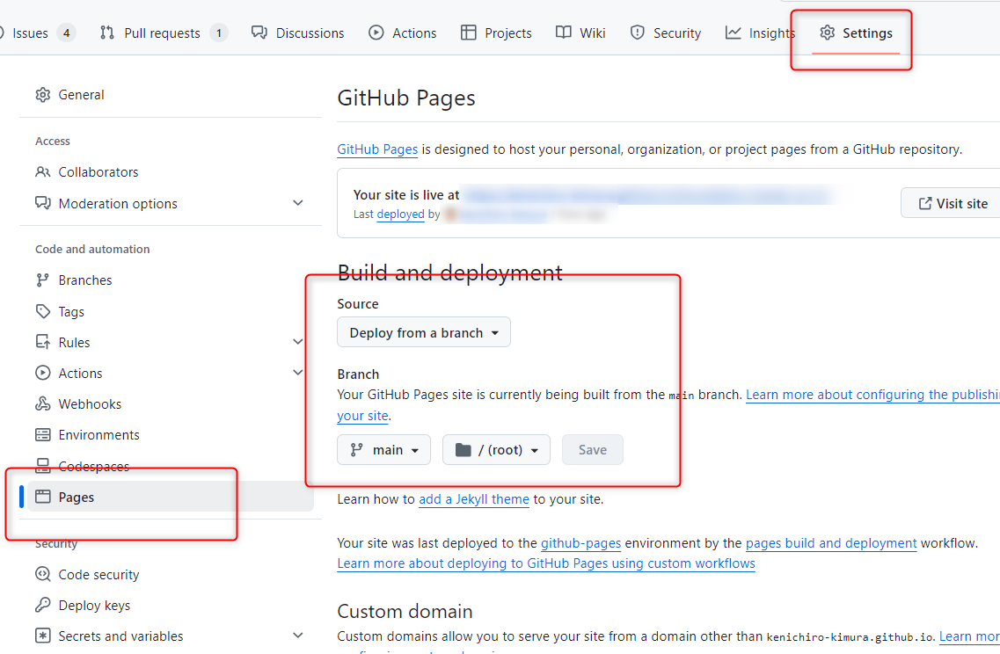
- しばらくしてリロードしてみるとURLがでてるのでアクセスする
  - 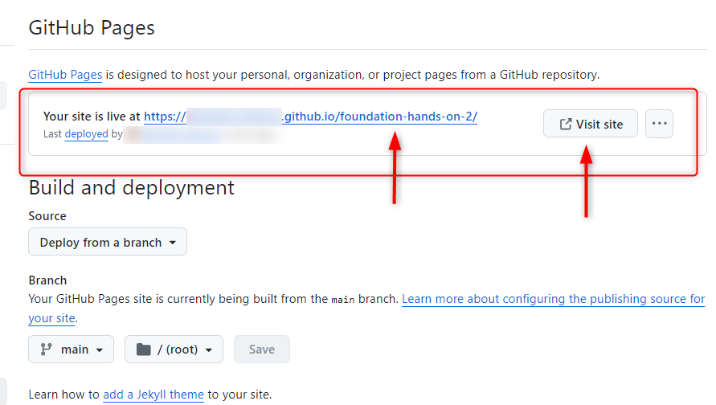
  - READMEの内容が見えることを確認する
- index.htmlを追加して再度アクセスすると、indexがみえる
- Settings > PagesのSourceで「GitHub Aciton」というのがあるのを確認する
  - ここでビルドしてコンテンツをデプロイする設定ができるので、時間があれば実際にやってみる

---

[前ドメインへ](../domain2/README.md)  
[次のドメインへ](../domain4/README.md)  
[目次へ](../README.md)
