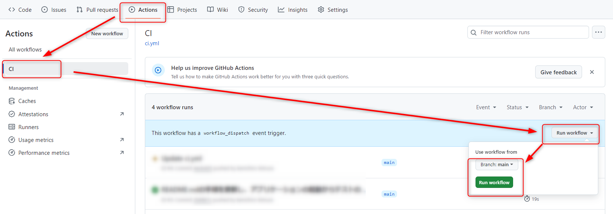
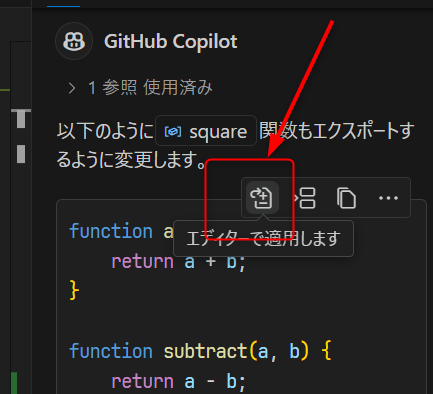
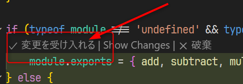
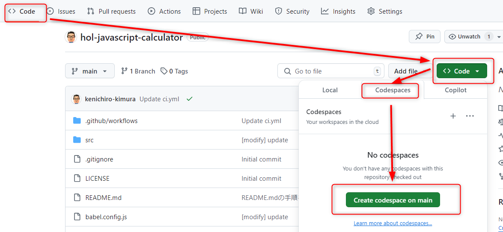
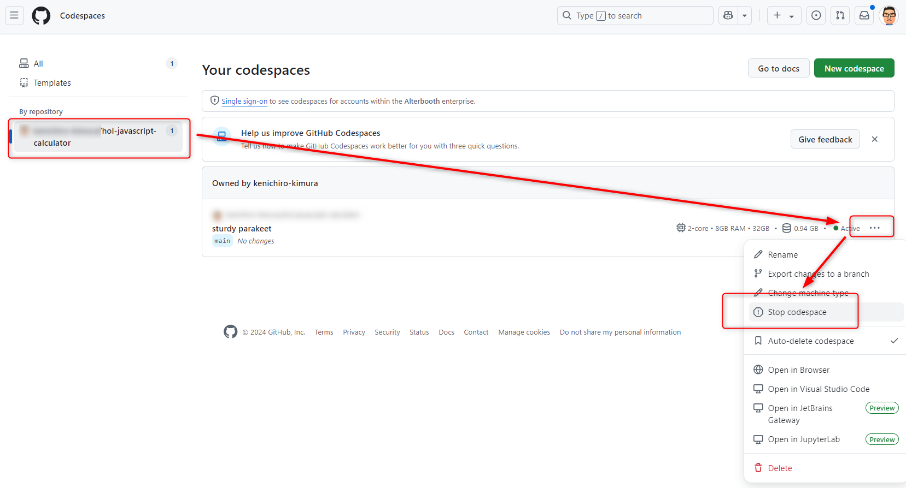

# ドメイン4:モダンな開発

## GitHub Actions

GitHub Actionsについて確認する。

- １. [サンプルのテンプレートリポジトリ](https://github.com/alterbooth/hol-javascript-calculator)から、自身のアカウントの下に`hol-javascript-calculator`リポジトリをPublicで作る
  - サンプルの内容は、簡単なHTMLとJavaScriptで作られた電卓アプリ

Actionsのワークフローをテンプレートから作成できることを確認する。

- ２. ナビゲーションのActionsにアクセスし、「set up a workflow yourself」リンクを選択する  
  
- ３. 今回は空のワークフローを作成する。ファイル名は`ci.yml`とする（ディレクトリは`hol-javascript-calculator/.github/workflows`のままでよい）。
- ４. [サンプルのYAML](./ci.yml)の内容を貼り付けて、「Commit changes...」ボタンから`main`ブランチにコミットする

このサンプルではコミットするとActionsのワークフローが実行されるので、ログを確認する。

- ５. ナビゲーションのActionsからActionsの実行一覧を開き、実行されたワークフローのログを確認する

時間があればテストが失敗するようにコードを変更してみる。

このサンプルではトリガーに`workflow_dispatch`が指定されているので、ワークフローを手動で実行できることを確認する。

- ６. ナビゲーションのActionsからActionsの実行一覧を開き、ワークフローの「CI」を選択する。「Run workflow」プルダウンから、「Run workflow」ボタンを選択し、ワークフローを手動で実行する。  
  
  - 実行するブランチは「main」のままとする

## GitHub Copilot

GitHub Copilotについて確認する。

次を準備する。

- １. 参加者は、Copilotのライセンスを所有しているならばそれを利用する
  - そうでない場合は、Copilot Freeプランを利用する

- ２. Visual Studio Code（以下、VS Code）に以下の拡張機能をインストールする
  - [GitHub Copilot](https://marketplace.visualstudio.com/items?itemName=GitHub.copilot)
    - 上記拡張機能をインストールすると、[GitHub Copilot Chat](https://marketplace.visualstudio.com/items?itemName=GitHub.copilot-chat)もインストールされる
  - GitHubへのサインインを求められたらサインインをする
- ３. 前節で作成した`hol-javascript-calculator`リポジトリを、手元のPCの任意のディレクトリにクローンする
- ４. VS Codeで`hol-javascript-calculator`ディレクトリを開く

GitHub Copilot Chatの動作を確認する。

- ５. `src/app.js`を開く
- ６. VS Codeの上部にあるCopilotアイコンから、Copilot Chatを開く
  - チャット欄に「このファイルに書かれているコードの説明をして」と入力してみる

GitHub Copilot Code completion（コード補完）の動作を確認する。

- ７. `src/app.js`の19行目(`function divide()`の定義の後ろ)にカーソルを持っていき、`function square(a){`と入力し、改行する
  - Copilotが二乗を計算する関数を提案してくれることを確認し、TABキーで確定する

ふたたび、GitHub Copilot Chatの動作を確認する。

- ８. Copilot Chatに「square関数もエクスポートして」と入力してみる
  - 提案内容を確認する
- ９. コード ブロックにカーソルを乗せ、表示された「エディターで適用」のアイコンをクリックする
  
- １０. エディターに適用された提案内容を確認し、「変更を受け入れる」をクリックして受け入れる
  

## GitHub Codespaces

GitHub Codespacesについて確認する。各個人がPublicに作成したリポジトリ上での利用であれば無料枠内で利用できるが、アカウントの制限でプライベートリポジトリしか作れない等でCodespacesを利用できない場合は講師のデモを見る。

- １. ブラウザで自身のアカウントの配下に作成した`hol-javascript-calculator`リポジトリを開き、ナビゲーションのCodeを開く
- ２. 「Code」ボタンのプルダウンからCodespacesタブの「Create codespace on main」ボタンでcodespaceを開いてみる  
  
- ３. ブラウザでVS Codeの画面が開き、ファイルが修正出来ることを確認する
- ４. 画面上部の「Terminal」→「New terminal」からターミナルを開き、`npm install`を実行してみる
- ５. 一度、ブラウザのcodespaceが開かれたタブを閉じる
- ６. 再び、`hol-javascript-calculator`リポジトリを開き、Codeボタンの「Codespaces」タブにアクセスする。すると、先ほど作成したcodespaceが一覧に表示されており、そこに再接続してみるとブラウザのタブを閉じる前にの状態に接続できていることを確認する
- ７. [https://github.com/codespaces](https://github.com/codespaces)にアクセスし、起動しているcodespaceの一覧を確認する
- ８. codespaceを停止してみる
  - 
- ９. 停止から再度アクセスすると、ターミナルの履歴が消えていることを確認する
- １０. 削除してみる
  - 無料枠を超えると課金が発生するため、不要なcodespaceは**必ず削除する**

github.devを確認する。

- １. ブラウザで自身のアカウントの配下に作成した`hol-javascript-calculator`リポジトリを開き、キーボードの「.」(ドット)を押して、github.devを開いてみる
  - Codespacesと違い、ターミナルを開いたり、複数のファイルを保存して1つのコミットにまとめることはできないことを確認する
- ２. github.comでリポジトリを開いている状態で、ドメインの`github.com`を`github1s.com`に変更してアクセスしてみる
  - これはオープンソースのプロジェクトで、github.devエディターと異なり、読み込み専用であることを確認する
  - 現在は公式の機能でgithub.devエディターがあるので、積極的にこれを使う必要はない

---
[前ドメインへ](../domain3/README.md)  
[次のドメインへ](../domain5/README.md)  
[目次へ](../README.md)
