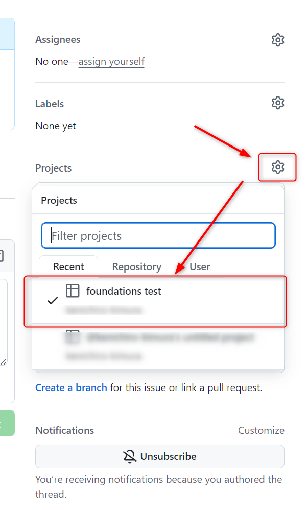
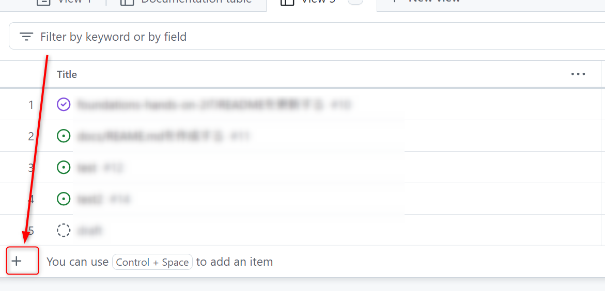
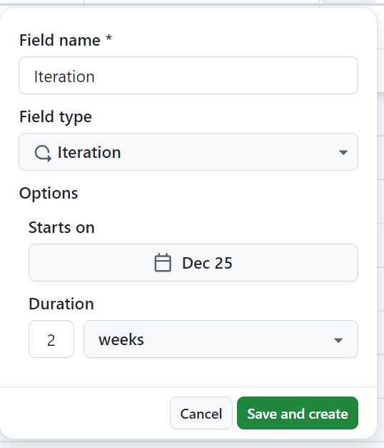
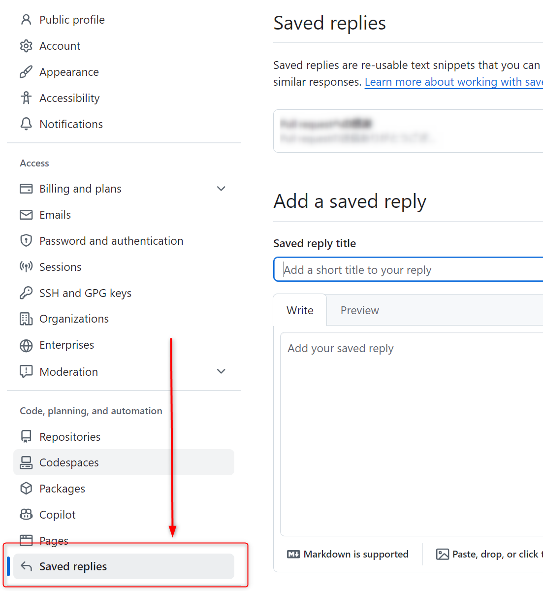

# ドメイン5:プロジェクト管理

## Projectsによるプロジェクト管理

Projectsを使ったプロジェクト管理について確認する。併せてLabelsとMilestonesについても確認する。

- 自身のアカウントページまたはリポジトリのナビゲーションの、Projectsにアクセスする
- Projectを作ってみる
  - 「New project」ボタンを押す。
  - 
  - テンプレートが複数あることを確認する。
    - 一旦「Start from scratch」から空のTableで作る
    - 
- ドメイン4で作成したリポジトリ`hol-javascript-calculator`でIssueを2つ作る
  - それぞれのIssueをProjectに紐付ける
  - 
- Projectのテーブルとカンバンでの見え方を確認する
  - カンバンでドラッグアンドドロップでToDoからInProgress、Doneと移動できることを確認する
    - 移動したときに、Issueの「Project」のデータが変わっていることを確認する
    - Doneに移動したらIssueが自動でCloseされることを確認する
    - Issueを再オープンすると、Project側がInProgressに戻っていることを確認する
    - Issueをクローズしたら、Project側がDoneになっていることを確認する
- 三点リーダーの「Workflows」から自動化のフローをみる
  - 
  - Item reopened/Item closedといった組み込みのワークフローがあり、これまで見てきて内容があることを確認する
- Project側からアイテムを追加してみる
  - 
  - プラスボタンからだと、Issueを作成するか、既存のIssueを追加するかが選べることを確認する
  - 空行のタイトルフィールドをクリックして入力すると、draft状態で作るか、Issueを作成するか、既存のIssueを追加するかが選べることを確認する
  - draftを作成してみて、Issueに紐付いていないことを確認する
    - 作成したdraftを「Convert to issue」でIssueに変換してみる
- テーブル表示でフィールドを追加してみる
  - イテレーションフィールドを追加する
    - 
    - 
    - イテレーションの開始日と期間を設定する
    - 
    - Iteration以外のタイプのフィールドも追加できることを確認する
  - 現在アイテムが2つ見えているはずなので、各アイテムのイテレーションを設定する
    - 
  - Viewの設定の「Group by」でイテレーションでまとめてみる
    - 
- `hol-javascript-calculator`リポジトリのナビゲーションのIssuesから、Labelsを追加してみる
  - 
  - Issueに設定してみる
  - Issueをラベルで検索してみる
  - Projectsで表示してみる
    - フィールドが表示されていない場合はLabelsフィールドを追加する
- `hol-javascript-calculator`リポジトリのナビゲーションのIssuesから、Milestonesを追加してみる
  - 
  - Issue2つにそれぞれMilestoneを設定してみる
  - Projectに戻り、ロードマップで見てみる
  - 2つのIssueのうち、1つクローズしてみる
    - Milestoneを確認すると進捗50％になってること確認する
- Project Insightを見てみる
- **デモ**
  - Projectをテンプレートにするボタンがどこにあるかを確認する
  - Organization配下のProjectでのみ行えるので、講師は自身の管理するOrganizationの下のProjectを開き、Settingsから該当の位置を見せる

## 返信テンプレート

返信テンプレートについて確認する。

- 任意の画面でアカウントアイコンをクリックし、`Settings`>`Code, planning, and automation`>`Saved replies`から返信テンプレートを作ってみる
  - 
- Issue/Pull requestに、saved repliesを使って返信してみる
  - 

---
[前ドメインへ](../domain4/README.md)  
[次のドメインへ](../domain6/README.md)  
[目次へ](../README.md)
