# ドメイン5:プロジェクト管理

## Projectsによるプロジェクト管理

Projectsを使ったプロジェクト管理について確認する。併せてLabelsとMilestonesについても確認する。

- github.comで、以下のいずれかからProjects一覧を表示し、「+ New project」ボタンを選択する
  - 任意のリポジトリ（ドメイン1で作成した`foundations-hands-on-1`リポジトリなど）のナビゲーションのProjectsを選択する  
    
  - 自身のプロフィールページのナビゲーションのProjectsを選択する  
    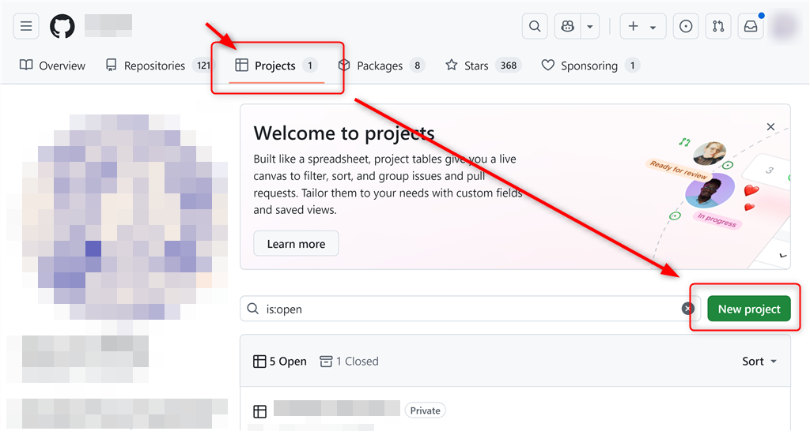
  - 右上のアイコンからメニューを表示し、「Your projects」を選択する  
    
- テンプレートが複数あることを確認する
- ここでは、「Start from scratch」から「Table」を選択する  
  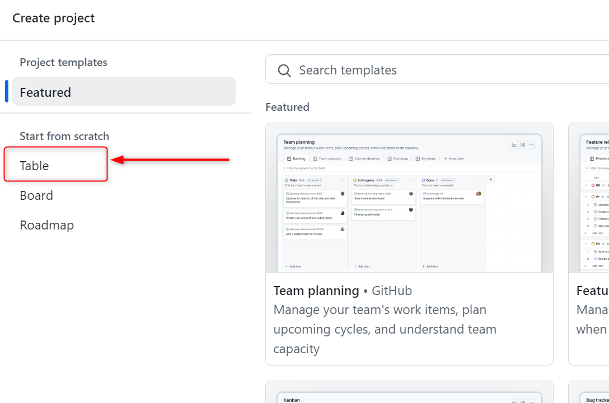
- 「Project name」に`foundations test`と入力し、「Create project」ボタンを選択する
- ドメイン4で作成したリポジトリ`hol-javascript-calculator`でIssueを2つ作る
  - それぞれのIssueで、右の「Projects」の歯車アイコンから、Project「foundations test」に紐付ける  
    
    - Issueに紐付けられたProjectは、次の図のように表示される  
      

ProjectのTableレイアウトとBoardレイアウトのビューの見え方を確認する。

- すでに作成されているTableレイアウトのビューを確認する
  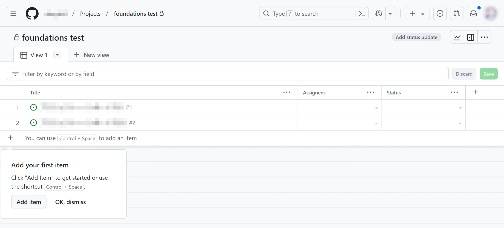
- 「+ New view」を選択し、「Layout」から「Board」を選択し、Boardレイアウトのビューを作成する  
  
- 作成したBoardレイアウトのビューを確認する  
  
- Boardレイアウトのビューで、アイテム（Issue）をドラッグアンドドロップして「No Status」から「Todo」に移動する
  - 移動したIssueを確認し、Issueの「Project」の状態（この場合はStatus）が反映されていることを確認する  
  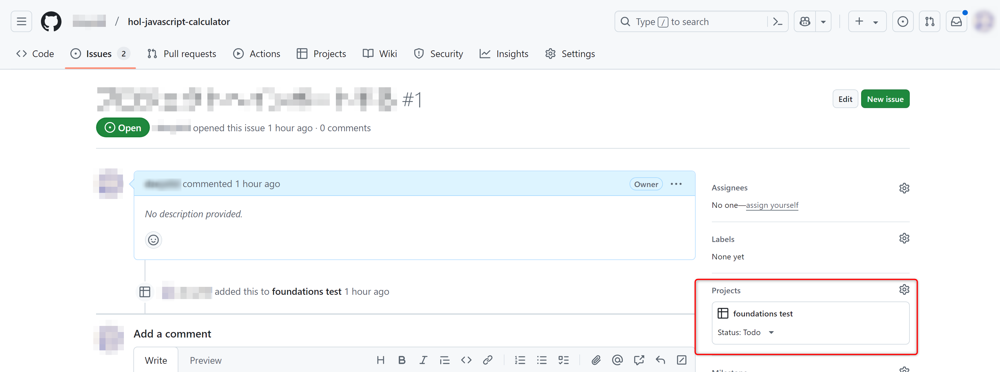
- ProjectのBoardレイアウトのビューで、アイテムを「Done」に移動する
  - StatusをDoneに変えると、紐付けたIssueが自動でCloseされることを確認する  
    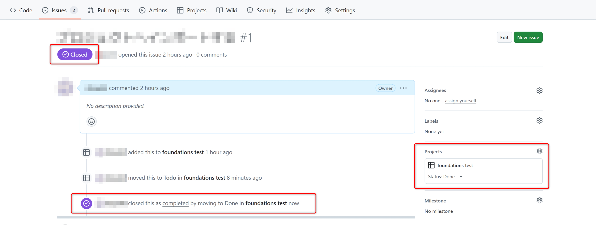

ProjectのWorkflowsで自動化のフローを確認する。

- Project画面右の三点リーダーの「Workflows」を開く  
  
- 組み込みのワークフローについて確認する
  - 例えば、デフォルトで有効になっているItem closedのワークフローにより、StatusをDoneに変更すると紐付けられたIssueがCloseされる

Projectでアイテムを追加してみる。

- Tableレイアウトのビューで、一覧の最後尾の「+」を選択する  
  
  - 「+」ボタンからの操作では、Issueを作成するか、既存のIssueを追加するかが選べることを確認する
- 「+」ボタンの横のテキストフィールドに何か入力する
  - この操作では、draft状態で作るか、Issueを作成するか、既存のIssueを追加するかが選べることを確認する
- draftを作成する
  - 作成したdraftは、Issueに紐付いていないことを確認する
- 作成したdraftを「Convert to issue」でIssueに変換してみる

フィールドを追加してみる。ここでは、Tableレイアウトのビューから、イテレーションフィールドを追加する。

- Tableレイアウトのビューで、一覧の右端の「+」を選択し、「+ New field」を選択する  
  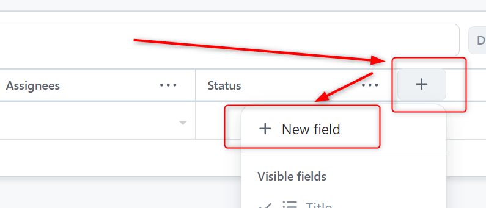
- 「Field name」を`Iteration`に変更し、「Field type」を「Iteration」に変更する  
  
- 「Options」の「Starts on」と「Duration」を操作し、イテレーションの開始日と期間を設定する  
  
- 現在アイテムが2つ見えているはずなので、それぞれ別のイテレーションを設定する  
  - 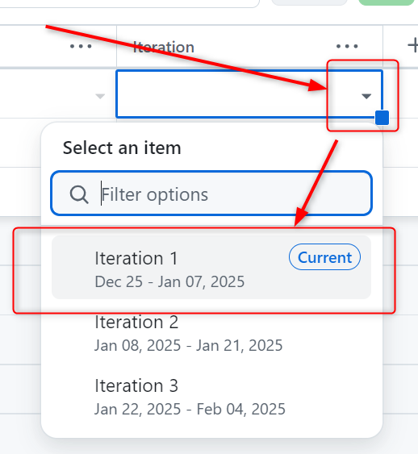
- ビューのタブのプルダウンから、「Group by」で「Iteration」を指定し、イテレーション毎にまとめてみる  
  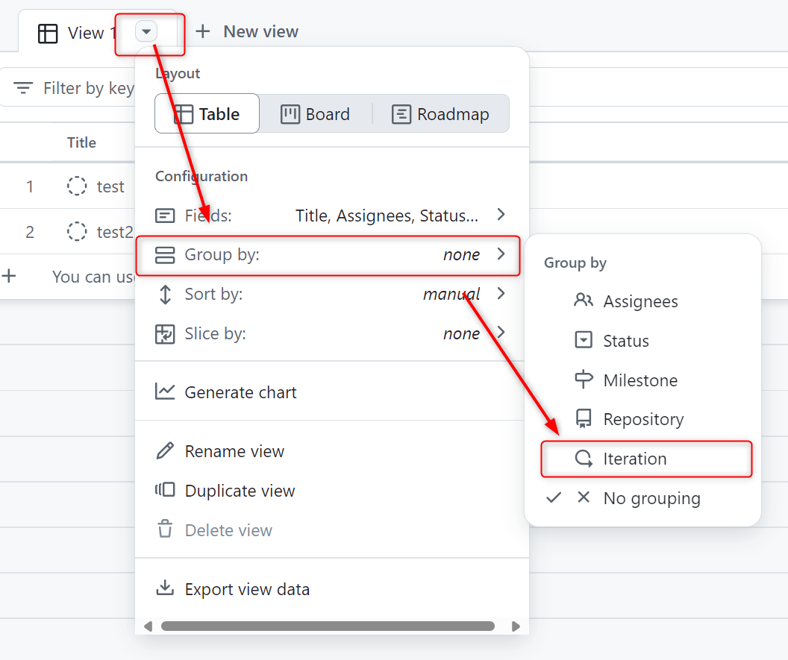
- Iteration以外のタイプのフィールドも追加できることを確認する

IssuesのLabelがProjectでも利用できることを確認する。

- `hol-javascript-calculator`リポジトリのナビゲーションからIssuesを開き、「Labels」を選択し、Labels一覧を表示する  
  
- 「New label」ボタンを選択し、「Label name」を入力して、「Create label」ボタンを選択する  
  
- Issueに作成したラベルを設定する  
  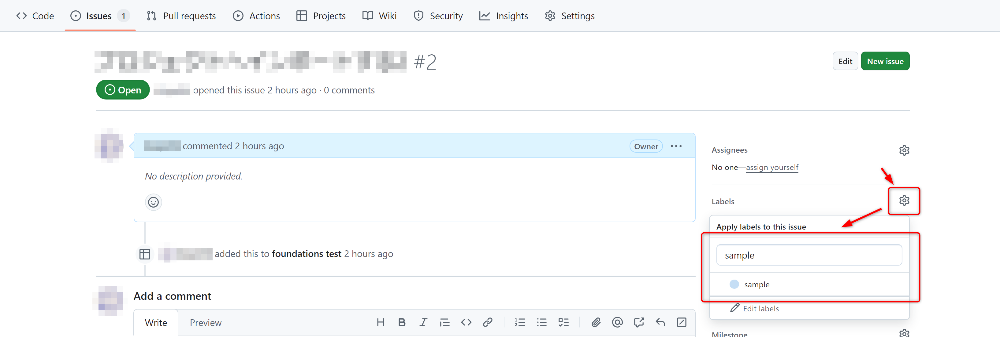
- Issueをラベルで検索してみる  
  
- Projectsの画面に戻り、Tableレイアウトのビューで「Labels」フィールドを表示する  
  

IssuesのMilestonesがProjectsでも利用できることを確認する。

- `hol-javascript-calculator`リポジトリのナビゲーションのIssuesから、「Milestones」を選択し、Milestones一覧を表示する  
  
- 「New Milestone」ボタンを選択する
    
- 「Title」に任意の文字列を入力し、「Due date」に本日の日付を指定して、「Create milestone」ボタンを選択してMilestoneを作成する  
  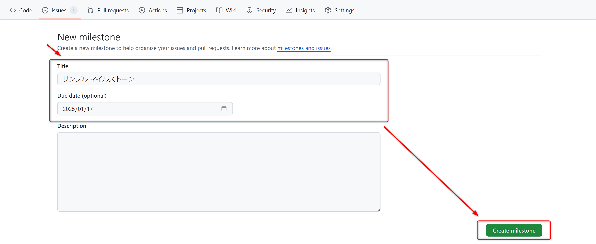
- 2つのIssueにそれぞれMilestoneを設定する
  > [!TIP]
  > Issueのうち1つはcloseされているはずなので、フィルタの`is:open`を削除してすべて表示させるか、一覧上部の「✓ 1 Closed」を選択して、CloseしたIssues一覧を表示して作業を進める
  - IssueにMilestoneを紐付ける
    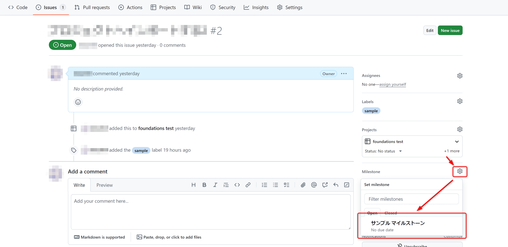
- Milestoneを確認すると進捗50％になってること確認する  
  

ProjectのRoadmapレイアウトのビューの見え方を確認する。

- Projectに戻り、Roadmapレイアウトのビューを作成する  
  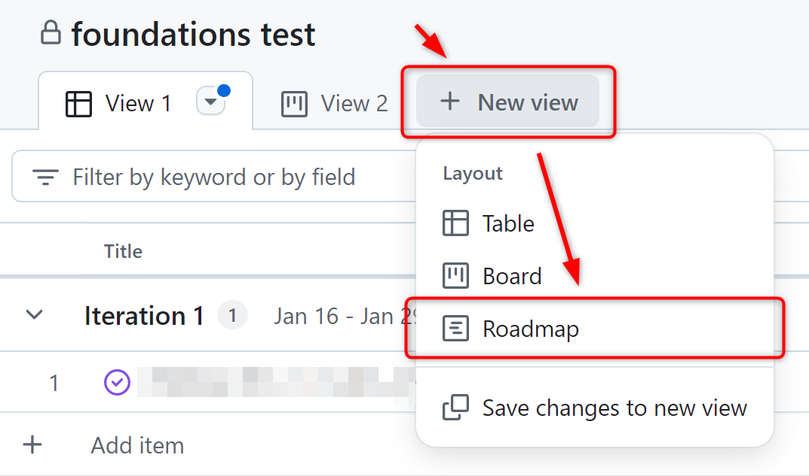
- 「Markers」に「Milestone」を指定する  
  
- Issuesに紐付けたMilestoneがMarkerとして表示されることを確認する  
  

Project Insightsを見てみる。

- Project画面の右のグラフのアイコンを選択する  
  
- Project InsightsのDefault chartsやCustom chartsを確認する  
  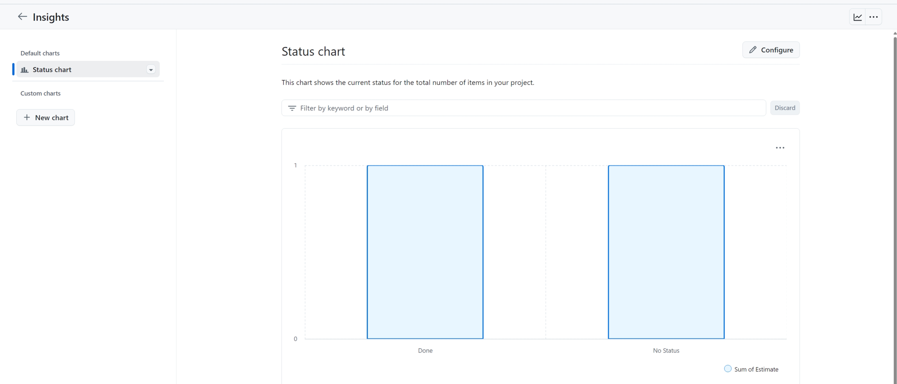

Projectのテンプレートを確認する（講師によるデモ）。

- Projectのテンプレートを新しく作成する
  - OrganizationのナビゲーションからProjectsを開き、左の「Templates」を開き、「New template」を選択する  
   
- 既存のProjectをテンプレートに変換する
  - 既存のProjectのSettingsを開き、「Templates」で「Make template」を操作する  
  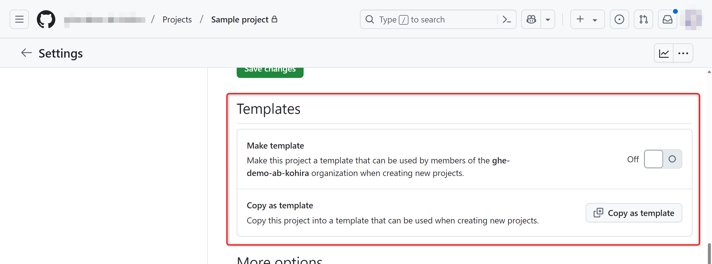
- 既存のProjectをコピーして、テンプレートを新しく作成する
  - Projectの三点リーダーのボタンから「Copy as template」を選択する  
    
  - 前述のProjectのSettingsのTemplatesから操作する

## 返信テンプレート

返信テンプレートについて確認する。

- 任意の画面でアカウントアイコンをクリックし、`Settings`>`Code, planning, and automation`>`Saved replies`から返信テンプレートを作ってみる  
  
- Issue/Pull requestに、saved repliesを使って返信してみる  
  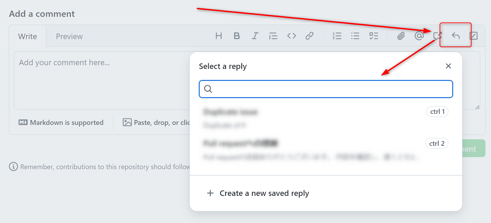

---
[前ドメインへ](../domain4/README.md)  
[次のドメインへ](../domain6/README.md)  
[目次へ](../README.md)
