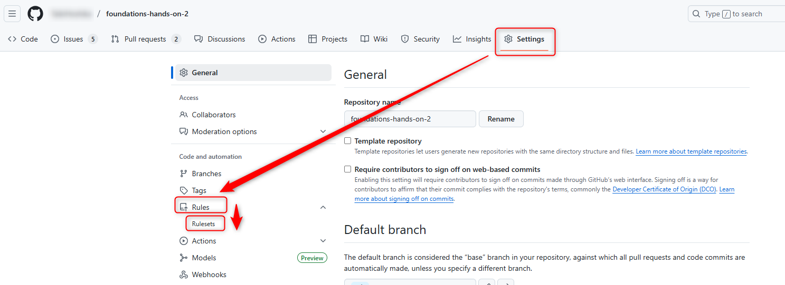
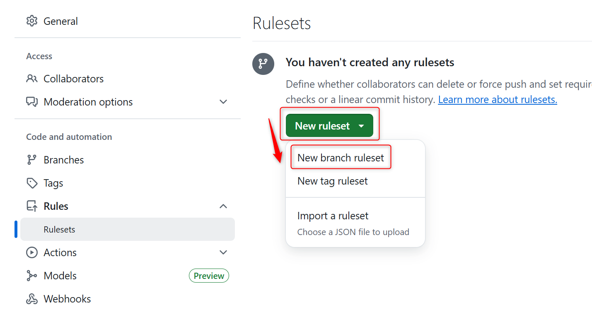
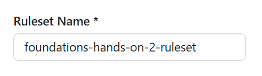
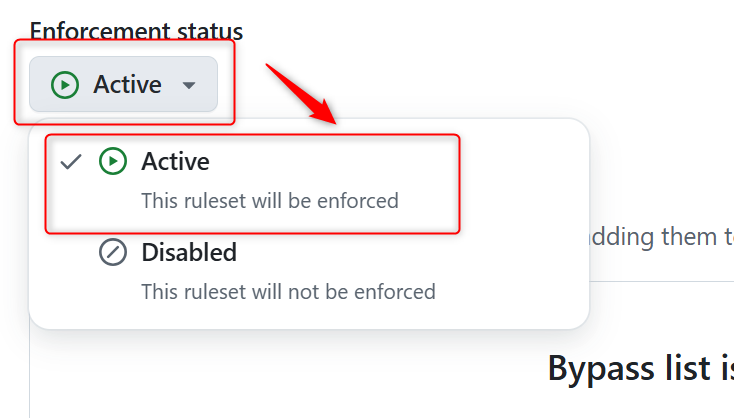
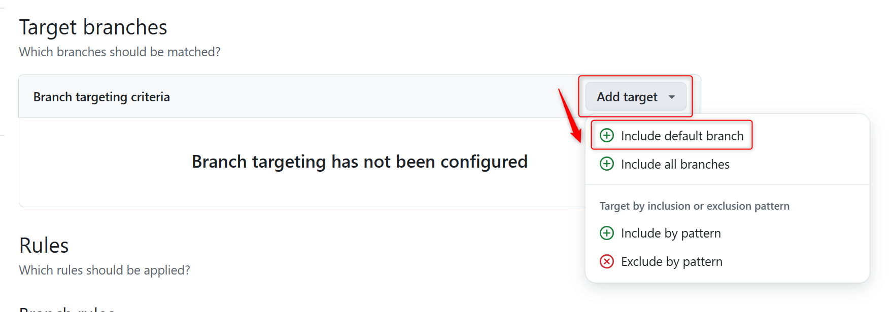
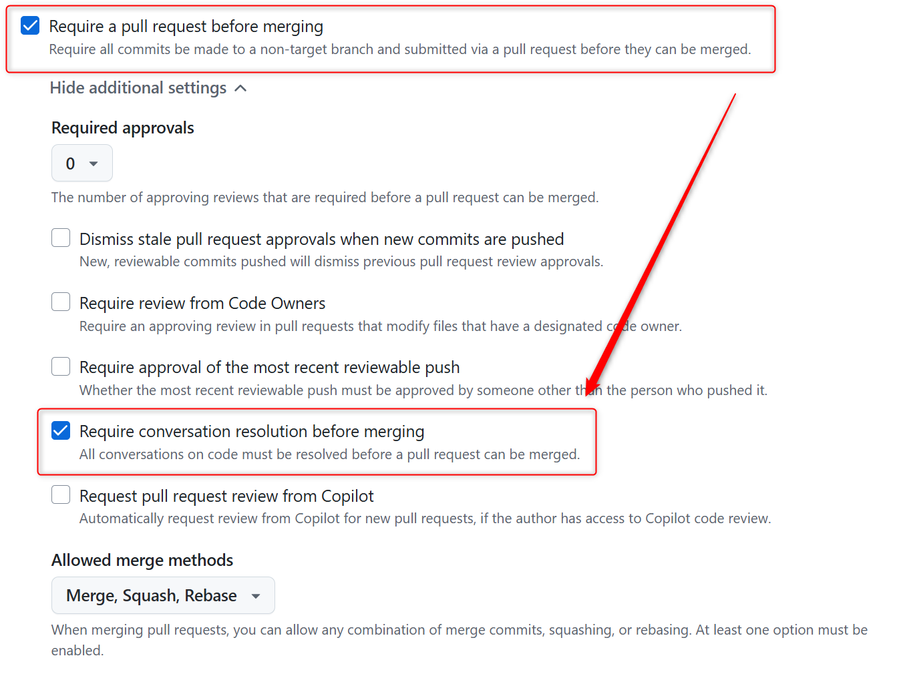
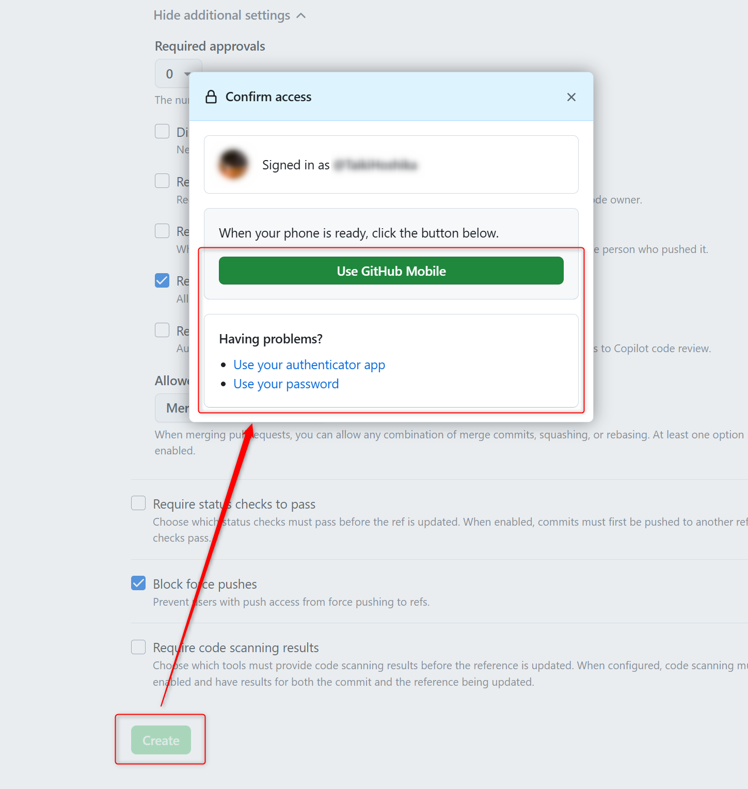
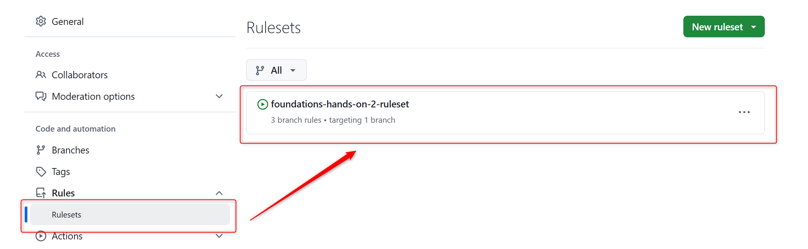

## ブランチ保護ルールの設定

ブランチ保護ルールの作成について確認する。

- １. `foundations-hands-on-2`リポジトリにgithub.comでアクセスし、ナビゲーションのSettingsにアクセスする
- ２． ルールセットの設定画面から新規ブランチルールセットを作成する
  - `Rules` ＞ `Ruleset` を選ぶ
  - 
  - `New ruleset` ＞ `New branch ruleset` を選ぶ
  - 
- ３． ブランチ保護のルールセットを作成する
  - `Ruleset Name`に`foundations-hands-on-2-ruleset`を入力する
  - 
  - `Enforcement status`を`Active`に設定する
  - 
  - `Branch targeting criteria`を`Include default branch`に設定する
  - 
  - `Require a pull request before merging`をチェック
  - 表示された追加項目内の`Require conversation resolution before merging`をチェック
  - 
  - ページ下部の、`Create`を押し、ルールセットを作成する
  - 認証が求められる場合があるため、その際は認証する
  - 
  - `Rulesets`から、ルールセットが作成されていることを確認する
  - 